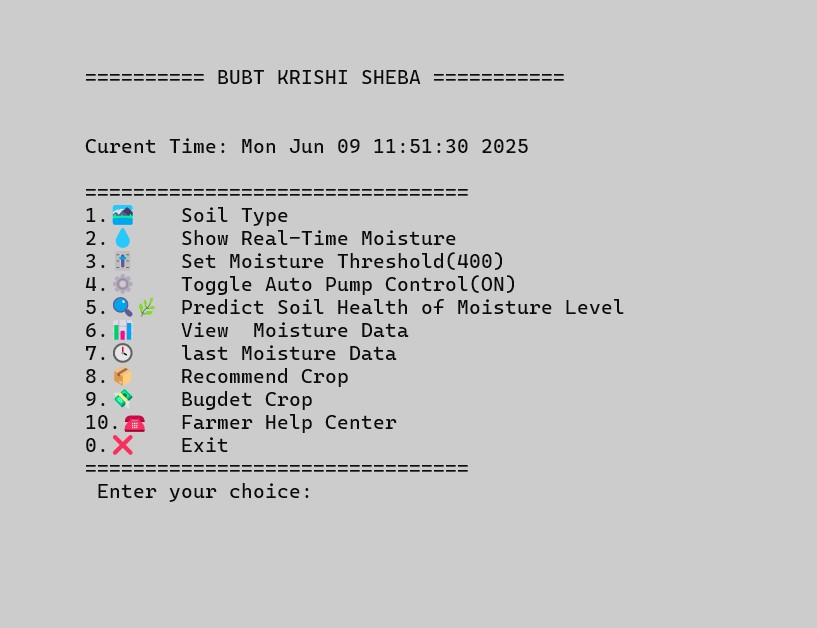

# krishi-sheba-
# 🌾 KRISHI SHEBA - Smart Agriculture Console App

🎉 **Champion** project at BUBT Software Development Project Idea Pitching (CSE100)

---

## 📌 About:
KRISHI SHEBA is a **C++ console-based smart agriculture management system** designed for Bangladeshi farmers. It simulates various features like soil moisture monitoring, crop recommendation, and budgeting—without the need for real sensors.

---

## 🚀 Features:

1. 🧱 **Soil Type** – Set the type of soil  
2. 💧 **Show Real-Time Moisture** – Simulate current soil moisture  
3. 🛠️ **Set Moisture Threshold** – Control moisture sensitivity  
4. ⚙️ **Toggle Auto Pump Control** – Auto irrigation control (simulated)  
5. 🔍🌿 **Predict Soil Health** – Based on historical moisture level  
6. 📊 **View Moisture Data** – Analyze stored data  
7. 🕒 **Last Moisture Data** – View last reading  
8. 📦 **Recommend Crop** – Based on soil & season  
9. 💰 **Budget Crop** – Cost estimation  
10. ☎️ **Farmer Help Center** – Support info  
0. ❌ **Exit** – Exit the system

---

## 🧠 Technologies Used:
- Language: **C++**  
- Platform: Windows Console (Code::Blocks)  
- Structure: Modular (Each feature in separate file)

---

## 📷 Screenshot:

---

## 🏆 Achievements:
🥇 Champion, Software Project Pitching Event - CSE100  
📅 Date: May 2025  
🏫 Department of CSE, BUBT  
🏢 Organized by: BASIS Students Forum – BUBT Chapter

---

## 👨‍💻 Team (Team_raw):

- **Lead Developers:** Shanto Gyn (Lead Coder) and Ratul Hasan  
- **Idea & Code Improvement Support:** Diponkor Pal, Ratul Hasan, Md. Arshad Biswas, Tamim

---

## 💻 How to Run:
1. Clone the repo or download the ZIP  
2. Open in Code::Blocks or any C++ IDE  
3. Compile and Run `main.cpp`

---

## 📫 Contact:
If you're interested in improving this project, feel free to fork or contribute!

- **Email:** gynshanto@gmail.com  
- **LinkedIn:** [Shanto Gyn](https://www.linkedin.com/in/shanto-gyn-933aa133b/)  
- **GitHub:** [shantogyn](https://github.com/shantogyn)

---

## 🔒 Copyright & Usage

Copyright (c) 2025 Team_raw

All rights reserved.

No part of this project or its source code may be copied, distributed, or used  
in any form without prior written permission from the owners (Team_raw).

Unauthorized use or reproduction will be subject to legal actions.

Lead of Project: Shanto Gyn and Ratul Hasan

